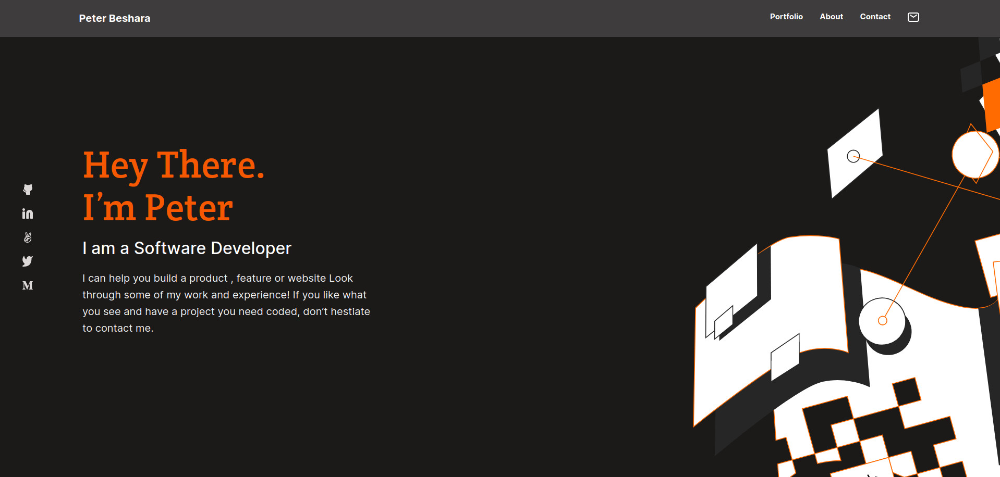
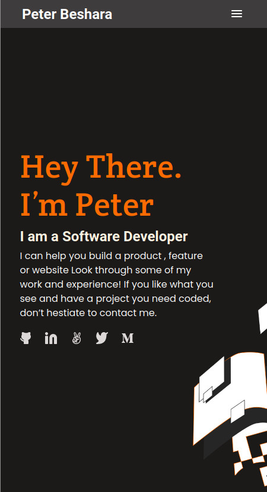
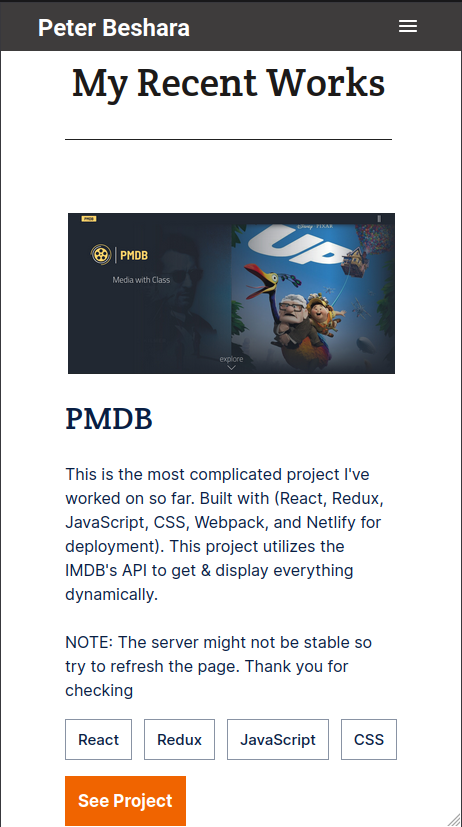

# Project Name
Portfolio

# Description the project.
Building a personal portfolio site.

## Built With

HTML
CSS
Git commands & VSCode(text editor)

## Screenshots

## Link to the Page

https://peter1907.github.io/Portfolio/

## Authors

👤 **Author1**

- GitHub: [@Peter1907](https://github.com/Peter1907)
- Twitter: [@Peter_Beshara_](https://twitter.com/Peter_Beshara_)
- LinkedIn: [LinkedIn](https://www.linkedin.com/in/peter-beshara-b33681241/)

## 🤝 Contributing

Contributions, issues, and feature requests are welcome!

You can clone the repo using this link (https://github.com/Peter1907/Portfolio.git)

Feel free to check the [issues page](https://github.com/Peter1907/Portfolio/issues).

## Show your support

Give a ⭐️ if you like this project!

## Acknowledgments

- Hat tip to anyone whose code was used
- Inspiration
- etc

## 📝 License

This project is [MIT](./MIT.md) licensed.
